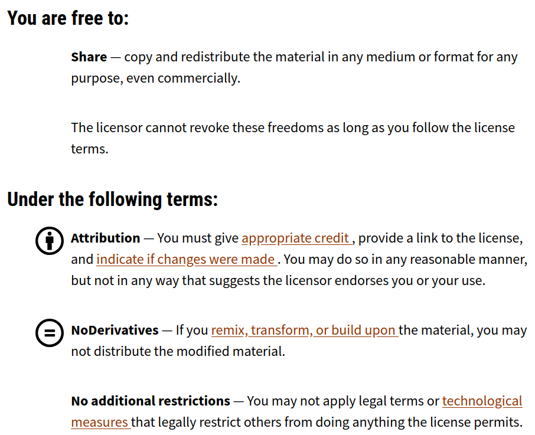

# PAN-NZ Source Datasets


## Purpose
The purpose of this document is two fold:

* To maintain a record of all known sources of Aotearoa New Zealand protected area datasets and their current state.

* To provide guidelines to data holders to support the inclusion of their data in the national Protected Areas Network of New Zealand (PAN-NZ).

The ultimate goal is to lift the quality, completeness, and accessibility of the PAN-NZ spatial dataset while supporting low-effort, frequent national data integration and publishing.

## PAN-NZ
PAN-NZ (Protected Areas Network – New Zealand) is a national initiative that improves how protected areas are documented, understood, and accessed through spatial data. Developed by Manaaki Whenua – Landcare Research, with funding from the Ministry for the Environment (MfE), PAN-NZ provides a consolidated national view of legal protections across Aotearoa New Zealand.

The programme aims to support better planning, monitoring, and reporting by:
* Consolidating spatial and descriptive protecteddata from central government, local government and non-profits organisation sources.
* Update the national protected areas information frequently 
* Classifying areas according to legal designations and IUCN categories.
* Enabling discovery and interpretation of protected area data through a national catalogue of datasets.
* Engaging with data holders to improve the clarity, openness, and completeness of data.

By increasing transparency and improving data quality, PAN-NZ helps decision-makers, researchers, iwi/Māori, and the public better understand the extent and types of protected areas in New Zealand.

## Contents
TODO// create ToC

## Context 
### What is a protected area
TODO// do we need to explain what a protected areas is? 


### Data Interoperability Principles
Interoperability means that data should be easy to discover, access, and integrate from the very first point of contact. We are not imposing rigid field names or internal database changes on data providers. Instead, our focus is on ensuring that the data is shared in a way that doesn't require users to dig deep, reverse-engineer formats, or chase down contacts just to make use of it.

To support this, we encourage the following:
* Standard metadata to describe the dataset clearly
* Open formats such as GeoJSON, Shapefile, or GeoPackage (GPKG)
* Stable API endpoints, ideally using open standards like OGC WFS and OGC API
* Clear documentation that explains field meanings and usage
* Consistent attribute naming, where possible


## PAN-NZ Source Data Guidelines 
These guidelines outline the minimum data requirements for data holders to ensure their protected areas data can be incorporated into PAN-NZ. Meeting these criteria ensures national consistency and long-term usability.

### Why Follow These Standards?
Aotearoa New Zealand has a rich and diverse network of protected areas — from national parks and reserves to QEII covenants and local council-protected sites. However, the ability to understand and represent these areas consistently at a national level depends on the quality and compatibility of the underlying data.

That’s where you come in.

The Protected Areas Network of New Zealand (PAN-NZ) is a national initiative that brings together datasets from local and central government, and NGOs. By contributing your data in a consistent format, you are helping to:
* Improve national visibility of protected areas in your region
* Support stronger environmental reporting, both domestically and to international frameworks like the IUCN and the Kunming-Montreal 30x30 target. 
* Empower local communities, councils, and planners with better spatial information
* Enable more effective land-use planning and biodiversity protection across regional boundaries
* Improve economic efficiency by clearly identifying areas where development is restricted, helping councils, developers, and infrastructure planners focus effort and investment in appropriate locations


The standards outlined in this document aren’t here to create extra burden — they are designed to reduce duplication, streamline integration, and make it easier to update data going forward. In many cases, small changes to metadata or access settings can have a big impact.

By aligning your datasets with these guidelines, you're not just supplying data — you're contributing to a nationally significant information layer that supports environmental stewardship across Aotearoa.

Requirements: 
Below are the data requirements that a protected area dataset must meet to be added to the national
PAN-NZ dataset 


## TODO// Primary headers
Perhaps this should be grouped by Access, Data types/fields, ...

### Data access
The below relates to data access...
#### 1. Licensing

Open licensing enables datasets to be combined at a national level without legal barriers or ambiguity as to how the data can be used. It ensures that PAN-NZ can be openly published, shared, and integrated with other public data.

Each dataset must have a clearly stated data licence that allows for reuse and redistribution. Preferably, this should be the [Creative Commons Attribution 4.0 (CC BY 4.0) licence](https://creativecommons.org/licenses/by/4.0/). The license should be supplied as part of the datasets metadata (TODO// see section ...metadata) and be clearly displayed at the point of access. This approach is consistent with the [New Zealand Governm-d 50to release data under open terms to maximise its value and reuse.


**Above:** An example of a protected areas source dataset with its licence clearly displayed at the point of access that allow for download for reuse. Example as per [Hawke's Bay Regional Parks](https://hub.arcgis.com/datasets/658697bb70c345f48d21cc002ecc0bef_1/explore) 


#### Licensing conditions exluding protected area data being included in PAN-NZ
Below are common reasons that licensing excludes data from being included in the national PAN-NZ data layer meaning the protected areas in that dataset will not appear in the national layer, limiting their visibility to policymakers, researchers, and the public.
* **No License:** If no licence is provided, PAN-NZ cannot include the dataset due to the ambiguity around the conditions of use concerning the dataset.
* **Too Restrictive of a License**: Some license allow degrees of public reuse but are too restrictive to inclusion on PAN-NZ. For example some protected
area dataset are licensed under [CC-BY-4.0](https://creativecommons.org/licenses/by/4.0/)	-NoNDerivatives (See the terms of
use in image directly below). This is problematic 
as PAN-NZ is a derivative, and data under this license therefore can not be 
included. 




**Above:** TODO//


If your organisation uses a different licence, or if there are restrictions on reuse, please provide clear documentation explaining the terms. We’re happy to work with you to understand options and ensure your data can be included.

#### 2. Data Access
PAN-NZ requires source datasets to be accessible with minimal effort for both those accessing and supplying the data.

Preferred methods of access (in order of preference):
* **API access:**
    Data supplied via an API can be fetched programmatically and automatically integrated into PAN-NZ. This allows for regular updates, ensuring the national dataset remains current and accurately reflects the latest information. API access includes data supplied through OGC (Open Geospatial Consortium) standards such as WFS (Web Feature Service), as well as RESTful APIs.

* **Direct download:**
    If an API is not feasible, datasets should be made available through a direct download link—ideally via an open data portal or a stable URL. This allows a PAN-NZ administrator to manually download the dataset. However, as it does not support automation, it is considered less efficient than API access.

    Both API and direct download options have the added benefit of discoverability. Services that support these access methods are typically indexed by search engines, making them easier for PAN-NZ administrators to find when searching for protected area data sources.

* **Download on request:**
    If neither of the above options is available, the PAN-NZ administrator may need to contact the data provider directly to request access. This approach requires significantly more effort for both parties. Additionally, because the dataset is not discoverable online, it risks being excluded from the national dataset simply because the administrator may not know it exists—or whom to contact to obtain it.

#### 3. Metadata

Metadata helps others understand and correctly interpret your dataset. While a full ISO 19115 record is ideal, PAN-NZ requires a minimum metadata profile with the following fields:
Field	Description
Title	Name of the dataset
Description	Short explanation of the dataset's purpose and contents
Creator / Owner	The organisation responsible for maintaining the dataset
Contact Email	A contact person for questions or updates
Licence	The reuse licence applied to the dataset
Date Updated	Most recent date of data revision or publication
Geographic Extent	Area covered (e.g. "Tasman District", or bounding box in WGS84)
Projection	Spatial reference system (e.g. NZTM2000 or EPSG:2193)
Format	File format used (e.g. GeoPackage, Shapefile)

If your dataset is listed in a formal metadata catalogue (e.g. Koordinates, ArcGIS Hub), include a link to the catalogue entry.


#### 3. Discoverability 
To support discoverability, councils can take several simple but effective steps to ensure their protected area datasets are visible and accessible to national initiatives like PAN-NZ:
* Publish data on open data portals such as their regional open data platforms, Koordinates, or data.govt.nz. These platforms are regularly indexed by search engines and commonly used by national data administrators.
* Ensure datasets have clear and descriptive metadata, including titles, descriptions, update frequencies, spatial coverage, and keywords such as “protected area,” “conservation land,” or “significant natural area.” Well-tagged metadata increases the likelihood that the dataset will surface in search results.
* Use consistent naming and formatting, particularly for datasets that are regularly updated. Avoid generic names like “Layer1.shp” in favour of more meaningful titles like “Waikato_Significant_Natural_Areas_2024.”
* Enable stable, shareable links to datasets—either as downloadable files or via API endpoints. This makes it easier for PAN-NZ administrators to access and revisit the data as needed.
* Include contact details or data stewards in metadata records, so that even if direct download or API access is not available, the right person can be easily identified and contacted.

By taking these steps, councils can help ensure their datasets are not only accessible, but also visible and usable within national frameworks—contributing to a more complete and accurate picture of protected areas across Aotearoa.


### Data Attributes


#### 1. PAN-NZ Schema 
The PAN-NZ schema defines a minimal set of attributes needed to describe protected areas consistently across New Zealand. These attributes help ensure clarity, traceability, and integration into the national dataset.


| Field Name                       | Description                                                                                                                           | Required |
| -------------------------------- | ------------------------------------------------------------------------------------------------------------------------------------- | -------- |
| `persistent_id`                  | A unique and persistent identifier for the protected area.                                                                            | Yes      |
| `name`                           | The commonly used or official name of the protected area.                                                                             | Yes      |
| `protection_legislation_act`     | The name of the legislation under which the area is protected.                                                                        | Yes      |
| `protection_legislation_section` | The specific section or clause of the act relevant to the protection.                                                                 | Yes      |
| `protection_type`                | The type or category of protection (e.g., reserve, covenant, SNA).                                                                    | No       |
| `local reserve`                  | The purpose of reserves under Section 22 (government purpose reserve) and section 23 (local purpose reserve) of the Reserved Act 1977 | No       |

The below sections expand on the above providing further details and requirements and the 
purpose of each section

#### 2. Protection Name

| PAN-NZ Schema Name | Required             |
| ------------------ | -------------------- |
| name               | yes - where recorded |

Where the managing entity assigns a name to each protected area, these names should be included in the dataset. Providing these names allows users to refer to individual protections using their commonly recognised or official titles, improving communication, consistency, and usability of the data in both local and national contexts.


#### 3. Legal Act

| PAN-NZ Schema Name | Required             |
| ------------------ | -------------------- |
| legislation        | yes - where recorded |

Datasets should specify the legislative act under which each area is protected. This field provides the legal context needed to confirm protection status and supports classification into IUCN categories.

Best practices:

* Use the full name of the Act (e.g. Reserves Act 1977), not abbreviations like "RA77".
* Each spatial extent should be associated with one act. That is if there are overlapping features (protected areas) with different legislative acts there should have their own spatial extents and be individual features. 


e.g. 
```
Conservation Act 1997
```

#### 4. Legal Section

Where applicable, include the specific section in the Act that establishes the legal protection.
This field provides the legal context needed to confirm protection status and supports classification into IUCN categories.


TODO// shall we create an appendix of all of the below (or atleast the most common)
We recommend this is in the format of `S_<Section Number>_<NAME>`

e.g. For a Ecological area under the Conservation Act this is as below. Note, the
convention of using capitals. This due to major central government dataset applying this 
convention to their legislation_section in their data. Lower can is also acceptable and 
data pipelines can consider this information as the same. 
```
S21_ECOLOGICAL_AREA
```
#### 5. Local Purpose Type


#### 6. Protection Type

This field should describe the kind of protection conferred by the legal status. It helps PAN-NZ group areas into consistent categories such as "Scenic Reserve", "Marine Reserve", or "Open Space Covenant".

Guidance:

    Use the terms defined in the underlying legislation.

    Avoid vague terms like "protected area" without specifying the type.


#### 7. Persistent Identifier

Each protected area record should ideally include a persistent, unique identifier (ID). This ensures records can be tracked across updates and matched across systems.

<!-- Requirements:
| PAN-NZ Schema Name | Required             |
| ------------------ | -------------------- |
| name               | yes - where recorded |

    Use UUIDs or an internal ID system. -->


Other standards to be aware of
https://www.linz.govt.nz/sites/default/files/2023-12/24a%2020%2020-B-0299%20-%20Attachment%20-%20NZGB%20Standard%20for%20Crown%20Protected%20Area%20Names%20FINAL%20-%20WKS.pdf


# TODO// should dicuss privacy 
i.e. we only want info that meets the privacy Act


# Potential PAN-NZ Datasets

## National 

| Custodian                    | Dataset name                         | License                                                   | Download URL                                                                                         | API Type       | API                                                                                                                                                         | ID         | Name Field | Legislation Act | Legislation Section | Protection Type | Reserve Purpose                    | <div style="width:400px">Comment</div>                                                                                                                                                                                                                                                                                                                                              |
| ---------------------------- | ------------------------------------ | --------------------------------------------------------- | ---------------------------------------------------------------------------------------------------- | -------------- | ----------------------------------------------------------------------------------------------------------------------------------------------------------- | ---------- | ---------- | --------------- | ------------------- | --------------- | ---------------------------------- | ----------------------------------------------------------------------------------------------------------------------------------------------------------------------------------------------------------------------------------------------------------------------------------------------------------------------------------------------------------------------------------- |
| Department of Conservation   | DOC Public Conservation Land         | [CC-BY-4.0](https://creativecommons.org/licenses/by/4.0/) | https://doc-deptconservation.opendata.arcgis.com/datasets/72354ba9bf7a4706af3fdfe60f86eea1_0/explore | ArcGIS GeoJSON | https://services1.arcgis.com/3JjYDyG3oajxU6HO/arcgis/rest/services/DOC_Public_Conservation_Land/FeatureServer/0/query?outFields=*&where=1%3D1&f=geojson     | NaPALIS_ID | Name       | Legislation     | Section             | -               | Local Purpose / Government Purpose | reserve purpose is split into local purpose and government purpose                                                                                                                                                                                                                                                                                                                  |
| Department of Conservation   | DOC Covenant Areas                   | [CC-BY-3.0](https://creativecommons.org/licenses/by/3.0/) | https://doc-deptconservation.opendata.arcgis.com/datasets/e35ba07f91aa47df9651f423f4ff11d0_0/        | ArcGIS GeoJSON | https://services1.arcgis.com/3JjYDyG3oajxU6HO/arcgis/rest/services/Covenant_Areas/FeatureServer/0/query?outFields=*&where=1%3D1&f=geojson                   | NaPALIS_ID | Name       | -               | -                   | Type            | Local Purpose / Government Purpose | reserve purpose is split into local purpose and government purpose                                                                                                                                                                                                                                                                                                                  |
| Department of Conservation   | DOC Internationally Recognised Areas | [CC-BY-4.0](https://creativecommons.org/licenses/by/4.0/) | https://doc-deptconservation.opendata.arcgis.com/datasets/f0cbb7544b1f4dae910fba8d8728d72a_0/        | ArcGIS GeoJSON | https://services1.arcgis.com/3JjYDyG3oajxU6HO/arcgis/rest/services/Internationally_Recognised_Areas/FeatureServer/0/query?outFields=*&where=1%3D1&f=geojson | NaPALIS_ID | Name       | Legislation     | Section             | Type            | Local Purpose / Government Purpose | reserve purpose is split into local purpose and government purpose                                                                                                                                                                                                                                                                                                                  |
| Department of Conservation   | DOC Marine Reserves                  | [CC-BY-4.0](https://creativecommons.org/licenses/by/4.0/) | https://doc-deptconservation.opendata.arcgis.com/datasets/0e74f9682502447c9a14d51340512361_0         | ArcGIS GeoJSON | https://services1.arcgis.com/3JjYDyG3oajxU6HO/arcgis/rest/services/DOC_Marine_Reserves/FeatureServer/0/query?outFields=*&where=1%3D1&f=geojson              | OBJECTID   | Name       | Legislation     | Section             | Type            | -                                  | -                                                                                                                                                                                                                                                                                                                                                                                   |
| Land Information New Zealand | LINZ Protected Areas                 | [CC-BY-4.0](https://creativecommons.org/licenses/by/4.0/) | https://data.linz.govt.nz/layer/53564-protected-areas/                                               | OGC WFS        | https://data.linz.govt.nz/services;key=<API_KEY>/wfs/layer-53564/?service=WFS&request=GetCapabilities                                                       | napalis_id | name       | legislation     | section             |                 | reserve_purpose                    |                                                                                                                                                                                                                                                                                                                                                                                     |
| Nga Whenua Rahui             | Nga Whenua Rahui                     | [CC-BY-4.0](https://creativecommons.org/licenses/by/4.0/) | https://nwr-open-data-nwr.hub.arcgis.com/datasets/3e788355a98a4e949f7baf8027a183cf_0/explore         | ArcGIS GeoJSON | https://services5.arcgis.com/ssqq9Ennhz28Dqcf/arcgis/rest/services/NWR_ProtectedAreas_Public_View/FeatureServer/0/query?outFields=*&where=1%3D1&f=geojson   | OBJECTID   | Name       | Act             | -                   | Type            | -                                  | Section and Act is combined e.g. Section 77A Reserves Act 1977                                                                                                                                                                                                                                                                                                                      |
| QEII Trust                   | QEII Open Space Covenants            | -                                                         | https://qeiinationaltrust.org.nz/publications-and-resources/gis-data/                                | -              | -                                                                                                                                                           | -          | -          | -               | -                   | Type            | -                                  | * No license but " Please note that the data includes details about private property. We ask that you are mindful of the Privacy Act when using the data, particularly when publishing.  “Please note that the data includes details about private property. We ask that you are mindful of the Privacy Act when using the data, particularly when publishing.  " \n no distinct id |

## Regional

### Parks and Reserves


### SNA


### Consents 

### Other


