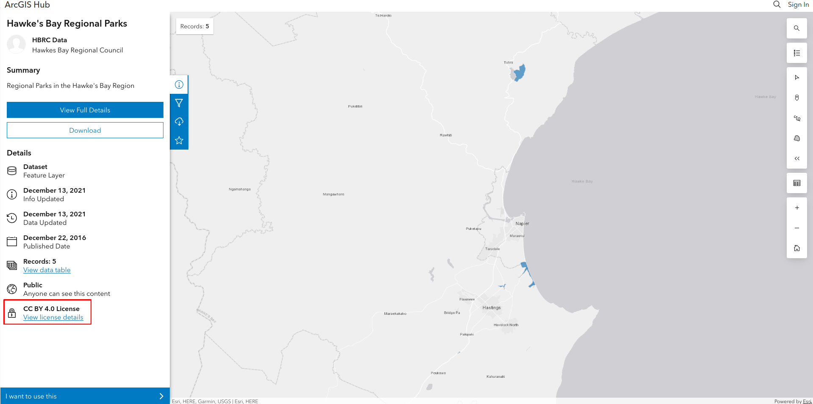
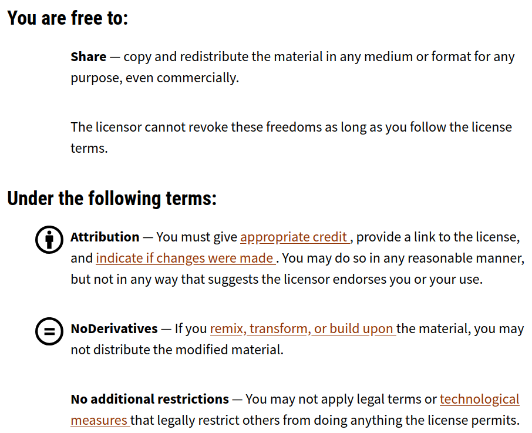

# PAN-NZ Data Stocktake and Guidelines

## TODo
Still outstanding:
- [] Explain why we are using github - it is a collaborative document....
- [] Though limitations
  - [] We ar enot using a fully fledged metadata catalog - this 
  is a limited funded project
- [ ] note, in the metadata table we have not included ESPG as it
  is not easily accessable in the arc products  
- [ ] A section illustrating why local govt data in important. imahge of the holes without it
- [ ] didcuss coveannts e.g. https://www.fndc.govt.nz/Council/district-plan/Conservation-covenants
  - [ ] Whangarei District Council has required the covenanting of 613 areas, totalling 
  - [ ] 9https://www.nrc.govt.nz/media/aealvfz0/protected-natural-areas-in-northland.pdf
  - [ ] 
2,266.0 h
- [ ] Disccus recent engagement ot indicate keenness e.g. 600+ at webinars

## Contents
- [PAN-NZ Data Stocktake and Guidelines](#pan-nz-data-stocktake-and-guidelines)
  - [TODo](#todo)
  - [Contents](#contents)
  - [PAN-NZ Context](#pan-nz-context)
    - [Document Purpose](#document-purpose)
    - [PAN-NZ](#pan-nz)
    - [Definition of Protected Area (for this stage of PAN-NZ)](#definition-of-protected-area-for-this-stage-of-pan-nz)
    - [Data Interoperability Principles](#data-interoperability-principles)
  - [PAN-NZ Source Data Guidelines](#pan-nz-source-data-guidelines)
    - [Why Follow These Standards?](#why-follow-these-standards)
    - [Data access](#data-access)
      - [1. Licensing](#1-licensing)
      - [Licensing conditions exluding protected area data being included in PAN-NZ](#licensing-conditions-exluding-protected-area-data-being-included-in-pan-nz)
      - [2. Data Access](#2-data-access)
      - [3. Metadata](#3-metadata)
      - [3. Discoverability](#3-discoverability)
      - [4. Privacy](#4-privacy)
    - [Data Attributes](#data-attributes)
      - [1. PAN-NZ Schema](#1-pan-nz-schema)
      - [2. Protection Name](#2-protection-name)
      - [3. Legal Act](#3-legal-act)
      - [4. Legal Section](#4-legal-section)
      - [5. Local Purpose Type](#5-local-purpose-type)
      - [6. Protection Type](#6-protection-type)
      - [7. Persistent Identifier](#7-persistent-identifier)
- [Potential PAN-NZ Datasets](#potential-pan-nz-datasets)
  - [National](#national)
  - [Regional](#regional)
    - [Parks and Reserves](#parks-and-reserves)
    - [SNA](#sna)

Data catalogues:
* ## Contents
- [Parks and Reserves Catalogue](parks_and_reserves_catalogue/)

## PAN-NZ Context
The below sections cover key concepts related to PAN-NZ (Protected Areas Network – New Zealand)

### Document Purpose
The purpose of this document is two fold:

* To maintain a record of all known sources of Aotearoa New Zealand protected area datasets and their current state.

* To provide guidelines to data holders to support the inclusion of their data in the national 
Protected Areas Network of New Zealand (PAN-NZ).

The ultimate goal is to lift the quality, completeness, and accessibility of the PAN-NZ spatial 
dataset while supporting low-effort, frequent national data integration and publishing.

### PAN-NZ
PAN-NZ (Protected Areas Network – New Zealand) is a national initiative that improves how protected 
areas are documented, understood, and accessed through spatial data. Developed by Manaaki Whenua – 
Landcare Research, with funding from the Ministry for the Environment (MfE), PAN-NZ provides a 
consolidated national view of legal protections across Aotearoa New Zealand.

The programme aims to support better planning, monitoring, and reporting by:
* Consolidating spatial and descriptive protected data from central government, local government 
and non-profits organisation sources.
* Update the national protected areas information frequently 
* Classifying areas according to legal designations and IUCN categories. This allows the filtering and sorting
of protection areas based on the degree of protection afforded to supported bio-diversity. 
* Enabling discovery and interpretation of protected area data through a national catalogue of datasets.
* Engaging with data holders to improve the clarity, openness, and completeness of data.

By increasing transparency and improving data quality, PAN-NZ helps decision-makers, researchers, 
iwi/Māori, and the public better understand the extent and types of protected areas in New Zealand.

### Definition of Protected Area (for this stage of PAN-NZ)
For the purposes of PAN-NZ, a protected area is defined as a geographically defined area 
that is recognised and managed through legislation or other formal instruments to achieve 
long-term protection of natural, cultural, or recreational values. This broad definition 
ensures inclusive national coverage of the many ways protection is implemented across 
Aotearoa New Zealand.

However, users can refine the dataset to suit more specific definitions—such as the 
formal IUCN definition of a protected area—by applying filters like IUCN category, 
legal basis, or protection type.

### Data Interoperability Principles
Interoperability means that data should be easy to discover, access, and integrate from the 
very first point of contact. We are not imposing rigid field names or internal database 
changes on data providers. Instead, our focus is on ensuring that the data is shared 
in a way that doesn't require users to dig deep, reverse-engineer formats, or 
chase down contacts just to make use of it.

To support this, we encourage the following:
* Standard metadata to describe the dataset clearly
* Open formats such as GeoJSON, Shapefile, or GeoPackage (GPKG)
* Stable API endpoints, ideally using open standards like OGC WFS and OGC API
* Clear documentation that explains field meanings and usage
* Consistent attribute naming, where possible

## PAN-NZ Source Data Guidelines 
These guidelines outline the minimum data requirements for data holders to ensure their 
protected areas data can be incorporated into PAN-NZ. 
### Why Follow These Standards?
Aotearoa New Zealand has a rich and diverse network of protected areas — from national parks and 
reserves to QEII covenants and local council-protected sites. However, the ability to
 understand and represent these areas consistently at a national level depends on the
  quality and compatibility of the underlying data.

That’s where you come in.

The Protected Areas Network of New Zealand (PAN-NZ) is a national initiative that brings 
together datasets from local and central government, and NGOs. By contributing your data in a consistent format, you are helping to:
* Improve national visibility of protected areas in your region
* Support stronger environmental reporting, both domestically and to international 
frameworks like the IUCN and the Kunming-Montreal 30x30 target. 
* Empower local communities, councils, and planners with better spatial information
* Enable more effective land-use planning and biodiversity protection across regional boundaries
* Improve economic efficiency by clearly identifying areas where development is restricted, 
helping councils, developers, and infrastructure planners focus effort and investment in appropriate locations

The standards outlined in this document aren’t here to create extra burden — they are designed to 
reduce duplication, streamline integration, and make it easier to update data going forward. 
In many cases, small changes to metadata or access settings can have a big impact.

By aligning your datasets with these guidelines, you're not just supplying data — 
you're contributing to a nationally significant information layer that supports environmental 
stewardship across Aotearoa.

Requirements: 
Below are the data requirements that a protected area dataset must meet to be added to the national
PAN-NZ dataset 

### Data access
PAN-NZ relies on timely, transparent, and open access to protected area data. To 
ensure datasets can be efficiently discovered, evaluated, and integrated into 
the national dataset, data holders should meet the access-related requirements
outlined in the below sections

#### 1. Licensing

Open licensing enables datasets to be combined at a national level without legal barriers or ambiguity as to how the data 
an be used. It ensures that PAN-NZ can be openly published, shared, and integrated with other public data.

Each dataset must have a clearly stated data licence that allows for reuse and redistribution. Preferably, 
this should be the [Creative Commons Attribution 4.0 (CC BY 4.0) licence](https://creativecommons.org/licenses/by/4.0/). 
The license should be supplied as part of the datasets metadata (TODO// see section ...metadata) and be clearly 
displayed at the point of access. This approach is consistent with the [New Zealand Governm-d 50to release 
data under open terms to maximise its value and reuse.

**Above:** An example of a protected areas source dataset with its licence clearly displayed at the point of 
access that allow for download for reuse. Example as per [Hawke's Bay Regional Parks](https://hub.arcgis.com/datasets/658697bb70c345f48d21cc002ecc0bef_1/explore) 

#### Licensing conditions exluding protected area data being included in PAN-NZ
Below are common reasons that licensing excludes data from being included in the national PAN-NZ data layer
 meaning the protected areas in that dataset will not appear in the national layer, limiting their visibility 
 to policymakers, researchers, and the public.
* **No License:** If no licence is provided, PAN-NZ cannot include the dataset due to the ambiguity around the 
conditions of use concerning the dataset.
* **Too Restrictive of a License**: Some license allow degrees of public reuse but are too restrictive to inclusion on PAN-NZ. For example some protected
area dataset are licensed under [CC-BY-4.0](https://creativecommons.org/licenses/by/4.0/)	-NoNDerivatives (See the terms of
use in image directly below). This is problematic as PAN-NZ is a derivative, and data under this license therefore can not be 
included. 

**Above:** TODO//

If your organisation uses a different licence, or if there are restrictions on reuse, please provide clear
 documentation explaining the terms. We’re happy to work with you to understand options and 
 ensure your data can be included.

#### 2. Data Access
PAN-NZ requires source datasets to be accessible with minimal effort for both those accessing and supplying the data.

Preferred methods of access (in order of preference):
* **API access:**
    Data supplied via an API can be fetched programmatically and automatically integrated into PAN-NZ. This allows 
    for regular updates, ensuring the national dataset remains current and accurately reflects the latest information.
     API access includes data supplied through OGC (Open Geospatial Consortium) standards such as WFS (Web Feature Service), as well as RESTful APIs.

* **Direct download:**
    If an API is not feasible, datasets should be made available through a direct download link—ideally via an 
    open data portal or a stable URL. This allows a PAN-NZ administrator to manually download the dataset. However,
     as it does not support automation, it is considered less efficient than API access.

    Both API and direct download options have the added benefit of discoverability. Services that support these 
    access methods are typically indexed by search engines, making them easier for PAN-NZ administrators to find
     when searching for protected area data sources.

* **Download on request:**
    If neither of the above options is available, the PAN-NZ administrator may need to contact the data provider 
    directly to request access. This approach requires significantly more effort for both parties. Additionally,
     because the dataset is not discoverable online, it risks being excluded from the national dataset simply
    because the administrator may not know it exists—or whom to contact to obtain it.

#### 3. Metadata

Metadata helps others understand and correctly interpret your dataset. While a full ISO 19115 record is ideal, 
PAN-NZ requires a minimum metadata profile with the following fields:

| Field             | Description                                                     |
| ----------------- | --------------------------------------------------------------- |
| Title             | Name of the dataset                                             |
| Description       | Short explanation of the dataset's purpose and contents         |
| Creator / Owner   | The organisation responsible for maintaining the dataset        |
| Contact Email     | A contact person for questions or updates                       |
| Licence           | The reuse licence applied to the dataset                        |
| Date Updated      | Most recent date of data revision or publication                |
| Geographic Extent | Area covered (e.g. "Tasman District", or bounding box in WGS84) |
| Projection        | Spatial reference system (e.g. NZTM2000 or EPSG:2193)           |
| Format            | File format used (e.g. GeoPackage, Shapefile)                   |

If your dataset is listed in a formal metadata catalogue (e.g. Koordinates, ArcGIS Hub), include a link to the catalogue entry.

#### 3. Discoverability 
To support discoverability, councils can take several simple but effective steps to ensure their 
protected area datasets are visible and accessible to national initiatives like PAN-NZ:
* Publish data on open data portals such as their regional open data platforms, Koordinates, or 
data.govt.nz. These platforms are regularly indexed by search engines and commonly used by national data administrators.
* Ensure datasets have clear and descriptive metadata, including titles, descriptions, update frequencies, 
  spatial coverage, and keywords such as “protected area,” “conservation land,” or “significant natural area.”
  Well-tagged metadata increases the likelihood that the dataset will surface in search results.
* Use consistent naming and formatting, particularly for datasets that are regularly updated. Avoid generic names
   like “Layer1.shp” in favour of more meaningful titles like “Waikato_Significant_Natural_Areas_2024.”
* Enable stable, shareable links to datasets—either as downloadable files or via API endpoints. This makes it 
  easier for PAN-NZ administrators to access and revisit the data as needed.
* Include contact details or data stewards in metadata records, so that even if direct download or 
  API access is not available, the right person can be easily identified and contacted.

By taking these steps, councils can help ensure their datasets are not only accessible, but also visible and
usable within national frameworks—contributing to a more complete and accurate picture of protected areas across Aotearoa.

#### 4. Privacy 
PAN-NZ aims to build an open and accessible national dataset of protected areas while upholding privacy obligations under the Privacy Act 2020. Data submitted for inclusion in PAN-NZ should not contain any personal or identifying information about individuals, including:
* Personal names (e.g. landowners or donors)
* Private addresses
* Contact details (e.g. phone numbers or email addresses)

What this means for contributors:
* Ensure all shared datasets are free of personal or sensitive information, unless express permission has been obtained and documented.
* If a dataset includes a contact person for managing or administering the protected area, ensure that the contact is a role-based or organisational contact, not an individual’s personal details.

General guidance:
* Where data involves land held in private title, confirm that the information is publicly available or anonymised.
* If in doubt, contact your organisation’s privacy officer or legal advisor to confirm the dataset is compliant with the Privacy Act before sharing with PAN-NZ.

By respecting privacy from the outset, we ensure that PAN-NZ remains a trustworthy, inclusive, and legally sound platform for environmental data.

### Data Attributes
The section below lists the minimum set of attributes needed to describe a protected area in a way that’s
meaningful and usable within PAN-NZ.

#### 1. PAN-NZ Schema 
The PAN-NZ schema defines a minimal set of attributes needed to describe protected areas consistently
 across New Zealand. These attributes help ensure clarity, traceability, and integration into the national dataset.

| Field Name                       | Description                                                                                                                           | Required |
| -------------------------------- | ------------------------------------------------------------------------------------------------------------------------------------- | -------- |
| `persistent_id`                  | A unique and persistent identifier for the protected area.                                                                            | Yes      |
| `name`                           | The commonly used or official name of the protected area.                                                                             | Yes      |
| `protection_legislation_act`     | The name of the legislation under which the area is protected.                                                                        | Yes      |
| `protection_legislation_section` | The specific section or clause of the act relevant to the protection.                                                                 | Yes      |
| `protection_type`                | The type or category of protection (e.g., reserve, covenant, SNA).                                                                    | No       |
| `local reserve`                  | The purpose of reserves under Section 22 (government purpose reserve) and section 23 (local purpose reserve) of the Reserved Act 1977 | No       |

The sections below provide further explanation of each required attribute, outlining its purpose, associated requirements, and how it contributes to the PAN-NZ dataset.

#### 2. Protection Name

| PAN-NZ Schema Name | Required             |
| ------------------ | -------------------- |
| name               | yes - where recorded |

If the managing entity assigns names to protected areas, they should be included. Providing a recognisable name helps users refer to each area via a common name, rather than relying on IDs alone.

#### 3. Legal Act

| PAN-NZ Schema Name | Required                 |
| ------------------ | ------------------------ |
| legislation_act    | yes - where not implicit |

Datasets should specify the legislative act under which each area is protected. This field provides the legal context needed to confirm protection status and supports classification into IUCN categories. Without this information 
the degree to which the areas is protected can not be communicated. 

However it is noted some datasets the legislation is implicit and this will suffice. For example for a dataset named "Regional Parks"
it may be inferred that the protected areas are under the Local Government Act 2002 and Section 139 Regional Park. This is the reason that required status is "yes - where not implicit"

Best practices:

* Use the full name of the Act (e.g. Reserves Act 1977), not abbreviations like "RA77".
* Each spatial extent should be associated with one act. That is if an area is associated with different legislative acts, 
each area with a different legislative act should have its own spatial extents. 

Examples of common legislative action can be found in the below section

#### 4. Legal Section

| PAN-NZ Schema Name  | Required                 |
| ------------------- | ------------------------ |
| legislation_section | yes - where not implicit |

Where applicable, include the specific section in the Act that establishes the legal protection.
This field provides the legal context needed to confirm protection status and supports classification into IUCN categories.

Ideally this is in the format of `S_<Section Number>_<NAME>`

The below table provides an example of a subset of the legislative Act and 
Sections that are commonly captured by PAN-NZ 

Note, the convention of using capitals. This due to major central government dataset applying this 
convention to their legislation_section in their data. Lower can is also acceptable and 
data pipelines can consider this information as the same. 

| Legislation Act                            | Legislation Section           |
| :----------------------------------------- | :---------------------------- |
| CONSERVATION_ACT_1987                      | S19_CONSERVATION_PARK         |
| CONSERVATION_ACT_1987                      | S20_WILDERNESS_AREA           |
| CONSERVATION_ACT_1987                      | S21_ECOLOGICAL_AREA           |
| CONSERVATION_ACT_1987                      | S22_SANCTUARY_AREA            |
| CONSERVATION_ACT_1987                      | S23A_AMENITY_AREA             |
| CONSERVATION_ACT_1987                      | S23B_WILDLIFE_MANAGEMENT_AREA |
| CONSERVATION_ACT_1987                      | S25_STEWARDSHIP_AREA          |
| LOCAL_GOVERNMENT_ACT_2002                  | S139_REGIONAL_PARK            |
| QUEEN_ELIZABETH_II_NATIONAL_TRUST_ACT_1977 | S22_QEII_OPEN_SPACE_COVENANT  |
| RESERVES_ACT_1977                          | S17_RECREATION_RESERVE        |
| RESERVES_ACT_1977                          | S19_1_A_SCENIC_RESERVE        |
| RESERVES_ACT_1977                          | S19_1_B_SCENIC_RESERVE        |
| RESERVES_ACT_1977                          | S23_LOCAL_PURPOSE_RESERVE     |
| RESERVES_ACT_1977                          | S17_RECREATION_RESERVE        |
| WILDLIFE_ACT_1953                          | S14_WILDLIFE_REFUGE           |
| WILDLIFE_ACT_1953                          | S9_WILDLIFE_SANCTUARY         |

#### 5. Local Purpose Type

| PAN-NZ Schema Name | Required                                                                |
| ------------------ | ----------------------------------------------------------------------- |
| reserve_purpose    | No - only for areas under section 22 and 23 under the Reserves Act 1977 |

Under the Reserves Act 1977, for areas protected under Section 22 (Government Purpose Reserve) and Section 23 (Local Purpose Reserve), the specific purpose of the reserve should be recorded in the reserve_purpose field. These types of reserves are used for a wide range of purposes — from wetland protection to gravel extraction — and capturing this detail helps clarify the intent and degree of protection. This information is essential for understanding how and why an area is protected.

#### 6. Protection Type
| PAN-NZ Schema Name | Required |
| ------------------ | -------- |
| protection_type    | No       |

This field is not required, but some datasets include a type field that describes the protection. Where the legal act and section are not available, this field can be used to infer the likely legislative basis for the protection.

While this is not the preferred approach—as it can introduce ambiguity and errors when mapping types to legislation—it may be used when no other legal context is available. In such cases, the type field can still provide valuable insight into the nature of the protection, even if it lacks formal precision.

This field should describe the kind of protection conferred by the legal status. for example as "Scenic Reserve", "Wildlife Sanctuary ", or "Recreation Reserve".

#### 7. Persistent Identifier
Requirements:
| PAN-NZ Schema Name | Required |
| ------------------ | -------- |
| id                 | yes      |

Each protected area record should ideally include a persistent, unique identifier (ID). This ensures records can be tracked across updates and matched across systems.

Other standards to be aware of
https://www.linz.govt.nz/sites/default/files/2023-12/24a%2020%2020-B-0299%20-%20Attachment%20-%20NZGB%20Standard%20for%20Crown%20Protected%20Area%20Names%20FINAL%20-%20WKS.pdf

# Potential PAN-NZ Datasets

## National 

## Regional

### Parks and Reserves

### SNA

