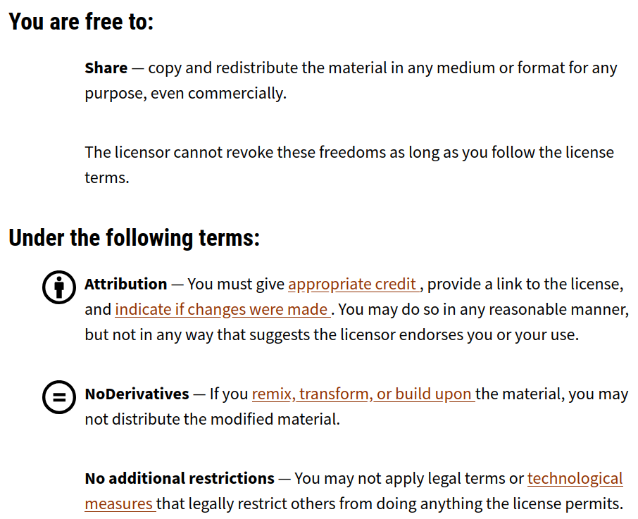

  <strong>DRAFT VERSION:</strong> These guidelines are currently in draft form and have not yet been finalised.
   We welcome your feedback to help refine and improve them.

 
These guidelines set out the minimum data requirements for protected area
datasets to be included in the Protected Areas Network of New Zealand (PAN-NZ)
national dataset. 

 

# Why Follow These Guidelines?
---
Aotearoa New Zealand has a rich and diverse network of protected areas,
including national parks, scenic reserves, QEII covenants, and council-managed
green spaces. Representing these areas consistently at a national level depends
on the quality and compatibility of the source data. 

PAN-NZ is a national initiative that brings together datasets from local and
central government, iwi, and NGOs. By providing your data in a consistent and
accessible format, you can help to: 
* Improve the national visibility of protected areas in your region 
* Strengthen environmental reporting, both within New Zealand and under
  international frameworks such as the IUCN and the Kunming-Montreal 30x30
  target 
* Support councils, communities, and planners with reliable spatial information 
* Enable more effective land-use planning and biodiversity protection across
  regional boundaries 
* Increase economic efficiency by identifying areas where development may be
  limited, helping focus effort and investment where it is most appropriate 

These guidelines are not intended to create unnecessary work. They aim to reduce
duplication of effort, streamline integration, and simplify updates in future. Often,
small changes to metadata or access settings can make a dataset far more usable
at the national level. 

By aligning your data with these guidelines, you are contributing to a
nationally significant layer that supports conservation, planning, and
transparent decision-making across Aotearoa. 

 

# How to Contribute to These Guidelines? 
---

These guidelines are currently in draft form, and we welcome your feedback. 

If you have suggestions, corrections, or would like to propose improvements,
please see the [Contribute / Contact]({{ site.baseurl }}/contributing/index.html)
section for information on how to get involved. 

Your input helps ensure the guidelines remain practical, inclusive, and widely
applicable across Aotearoa. 

 
# Requirements
---
Below are the minimum requirements that a protected area dataset must meet to be
included in the national PAN-NZ dataset. 

 
## Data access
---
To ensure datasets can be easily discovered, evaluated, and integrated into the
national dataset, data holders should meet the following access-related
criteria. 

### 1. Licensing
Open licensing enables datasets to be used nationally without legal uncertainty.
It allows PAN-NZ to be openly published, shared, and integrated with other
public data. 

Each dataset must have a clearly stated data licence that permits reuse and
redistribution in derivative form. The preferred licence is [Creative Commons
Attribution 4.0 (CC BY 4.0)](https://creativecommons.org/licenses/by/4.0/). The
licence should be included in the dataset’s metadata and clearly visible at the
point of access. This aligns with the [New Zealand Government
NZGOAL framework](https://www.data.govt.nz/toolkit/policies/nzgoal), which encourages open
release of public data to maximise value and reuse. 

 

**Above:** Example of a protected area dataset with its licence clearly displayed at the point of access, ensuring it can be reused and shared. Example as per
[Hawke's Bay Regional
Parks](https://hub.arcgis.com/datasets/658697bb70c345f48d21cc002ecc0bef_1/explore) 

 

#### Common Licensing Issues That Exclude Datasets 
Below are common licensing issues that prevent datasets from being included in
the national PAN-NZ data layer. When licensing excludes a dataset, the protected
areas it contains may not appear in the national PAN-NZ layer, limiting their
visibility to policymakers, researchers, and the public. 
* **No License:** Without a licence, the reuse conditions are unclear and the dataset cannot be included. 
* **Restrictive licence:** Licences such as [CC BY-ND (No
  Derivatives)](https://creativecommons.org/licenses/by-nd/4.0/) (see the CC BY-ND terms
  of use in image directly below) prohibit modifications or integration with
  other datasets. Since PAN-NZ requires remixing and aggregation, such datasets
  are excluded. 

 

**Above:** The [CC BY-ND (No Derivatives)](https://creativecommons.org/licenses/by-nd/4.0/) license which excludes
derivatives as a result of remixing, transforming or building upon the original data. Such licenses
excludes datasets from PAN-NZ    
 

 
### 2. Data Access
PAN-NZ prioritises datasets that are easy to access and incorporate. Preferred
methods are listed below in order of suitability: 
* **API access:** Data provided via API (such as OGC WFS or REST services) allows
  for automated integration and regular updates. 
* **Self-service download:** If API access is not feasible, datasets should be made
  available through a direct download link. This enables a PAN-NZ administrator
  to manually retrieve the data. 

  Both API and download options support discoverability, as these services are
  typically indexed by search engines. This makes them easier for PAN-NZ
  administrators to locate when searching for protected area data sources. 

* **Email request:** If neither of the above options is available, data may be
  provided by email. However, this approach increases the workload for both
  the parties requesting and supplying the data and limits discoverability. Datasets
  that are not publicly visible or accessible may be missed simply because
  administrators do not know they exist or cannot identify a contact person. 

 
 

### 3. Metadata
Metadata provides essential context to help users understand and correctly
interpret your dataset. While a full ISO 19115 metadata record is ideal, PAN-NZ
requires only a minimal metadata profile containing the following fields: 

| Field             | Description                                                                    |
| ----------------- | -------------------------------------------------------------------------------------------------------- |
| Title             | Name of the dataset                                                                                      |
| Description       | Short explanation of the dataset's purpose and contents                                                  |
| Creator / Owner   | The organisation responsible for maintaining the dataset                                                 |
| Contact Email     | A contact person for questions or updates                                                                |
| Licence           | The licence applied to the dataset                                                                       |
| Date Updated      | Most recent date of data revision or publication                                                         |
| Geographic Extent | Area covered (e.g. "Tasman District", or bounding box in WGS84)                                          |
| Projection        | Spatial reference system (e.g. NZTM2000 or EPSG:2193)                                                    |
| Format            | API protocol or file format that the data is shared in (e.g. OGC WFS, ESRI REST, GeoPackage, Shapefile)  |

 

### 4. Discoverability 
To ensure your protected area datasets are visible and accessible to PAN-NZ and
other users, we encourage the following good practices: 
* **Publish data on open data portals:** Hosting datasets on platforms such as
Koordinates, ArcGIS Online, council open data sites, or
[data.govt.nz](https://data.govt.nz/catalogue-guide/releasing-data-on-data-govt-nz)
significantly improves visibility. These platforms are routinely indexed by
search engines, making your data easier to discover. 
* **Use clear and descriptive metadata:** Include titles, summaries, spatial
coverage, and keywords such as “protected area,” “conservation land,” or
“reserves”. Well-tagged metadata increases the chances your
dataset will appear in search results. 
* **Apply consistent naming conventions:** Avoid generic names like Layer1.shp.
  Instead, use clear titles such as Waikato_Parks_and_Reserves to improve
  clarity. 
* **Ensure stable access URLs:** Maintain consistent download and API URLs so
  that PAN-NZ administrators can access your dataset reliably over time. 
* **Provide contact details in metadata:** Contact details should ideally be for
  the team responsible for the dataset and use a shared email to ensure
  continuity if staff roles change. Including an individual contact name
  alongside a shared email is also helpful. Providing clear contact details
  supports data users in reaching the right person or team with questions or
  update requests. 
* **Register your dataset in the PAN-NZ data catalogues:** Ensure your dataset is
  recorded in the [cataloguing
  component]({{ site.baseurl }}/data_catalogues.html)
  of this site. 

By following these steps, your dataset becomes easier to discover, interpret,
and integrate into national frameworks, contributing to a clearer and more
complete picture of protected areas across Aotearoa. 

 

### 5. Privacy 
PAN-NZ aims to develop an open and accessible national dataset of protected
areas while fully complying with the Privacy Act 2020. Public-facing datasets
should not include any personal or identifying information about individuals.
This includes, but is not limited to: 
* Personal names (e.g. landowners) 
* Contact details (e.g. phone numbers or email addresses) 

Maintaining privacy from the outset helps ensure that PAN-NZ remains a trusted,
inclusive, and legally compliant platform for sharing environmental information. 

 

## Data Attributes
---
The section below lists the minimum set of attributes needed to describe a
protected area in a way that’s meaningful and usable within PAN-NZ. 

 

### 1. PAN-NZ Schema 
To support consistent integration across New Zealand, PAN-NZ defines a minimal
schema for describing protected areas. This schema outlines the essential
attributes each dataset should contain to be eligible for inclusion in the
national dataset. 

The table below specifies the minimum attributes required for each protected
area record. While we expect many datasets to contain additional information,
only the fields listed here are considered necessary for national aggregation.
Additional attributes may still be valuable locally but will not be carried into
the PAN-NZ core dataset. 

Note: While we define preferred field names, your dataset does not need to use
these exact names. The key requirement is that the information is present. Field
mappings can be applied during aggregation to align your dataset with the PAN-NZ
schema. 

| Field Name          | Description                                                                                                                           | Required |
| ------------------- | ------------------------------------------------------------------------------------------------------------------------------------- | -------- |
| protected_area_id   | A unique and persistent identifier for the protected area.                                                                            | Yes      |
| name                | The commonly used or official name of the protected area.                                                                             | Yes      |
| legislation_act     | The name of the legislation under which the area is protected.                                                                        | Yes      |
| legislation_section | The specific section or clause of the act relevant to the protection.                                                                 | Yes      |
| protection_type     | The type or category of protection (e.g., reserve, covenant, national park).                                                          | No       |
| local_reserve       | The purpose of reserves under Section 22 (government purpose reserve) and section 23 (local purpose reserve) of the Reserved Act 1977 | No       |
| start_date          | The date the protection came into effect                                                                                              | Yes      |
| end_date            | The date the protection was formally removed                                                                                          | Yes      |

Further detail on each field is provided in the following sections, including
how they support national integration and classification (e.g. IUCN category
mapping). 

 

### 2. Persistent Identifier

| PAN-NZ Schema Name | Required |
| ------------------ | -------- |
| protected_area_id  | yes      |

Each protected area record should include a persistent, unique identifier. This
ensures records can be tracked across updates and matched across systems. 

 

### 3. Protection Name

| PAN-NZ Schema Name | Required             |
| ------------------ | -------------------- |
| name               | yes - where recorded |

If the managing entity assigns names to protected areas, they should be
included. Providing a recognisable name helps users refer to each area via a
common name, rather than relying on IDs alone. 

This can also assist in linking protections to other sources of information that
rely on names as common identifiers, such as management plans that refer to
protected areas by name. 

 

### 4. Legal Act

| PAN-NZ Schema Name | Required                 |
| ------------------ | ------------------------ |
| legislation_act    | yes - where not implicit |

Datasets should specify the legislative Act under which each area is protected.
This field provides the legal context needed to confirm protection status and
supports classification into IUCN categories. Without this information the
degree to which the areas is protected can not be communicated. 

In some cases, however, the legislation may be implied from the
dataset context. For example, a dataset titled “Regional Parks” may be
understood to refer to areas protected under Section 139 of the Local Government
Act 2002. For this reason, this field is marked as required where not implicit. 

Best practices: 
* Use the full name of the Act (e.g. Reserves Act 1977), not abbreviations like
  “RA77”. 
* Each spatial extent should correspond to a single legislative Act. If multiple
  acts apply, separate spatial features should be created for each. 

Examples of common protected area related legislation can be found in the below
section 

 

### 5. Legal Section

| PAN-NZ Schema Name  | Required                 |
| ------------------- | ------------------------ |
| legislation_section | yes - where not implicit |

Where applicable, include the specific section in the Act that establishes the
legal protection. This field provides the legal context needed to confirm
protection status and supports classification into IUCN categories. 

The preferred format is: “S<Section Number> <Section Name>”. For example: “S19
Conservation Park”. 

The below table provides an example of a subset of the legislative acts and
sections that are commonly captured by PAN-NZ 

| Legislation Act                            | Legislation Section           |
| :----------------------------------------- | :---------------------------- |
| Conservation Act 1987                      | S19 Conservation Park         |
| Conservation Act 1987                      | S20 Wilderness Area           |
| Conservation Act 1987                      | S21 Ecological Area           |
| Conservation Act 1987                      | S22 Sanctuary Area            |
| Conservation Act 1987                      | S23a Amenity Area             |
| Conservation Act 1987                      | S23b Wildlife Management Area |
| Conservation Act 1987                      | S25 Stewardship Area          |
| Local Government Act 2002                  | S139 Regional Park            |
| Queen Elizabeth II National Trust Act 1977 | S22 QEII Open Space Covenant  |
| Reserves Act 1977                          | S17 Recreation Reserve        |
| Reserves Act 1977                          | S19-1a Scenic Reserve         |
| Reserves Act 1977                          | S19-1b Scenic Reserve         |
| Reserves Act 1977                          | S23 Local Purpose Reserve     |
| Reserves Act 1977                          | S17 Recreation Reserve        |
| Wildlife Act 1953                          | S14 Wildlife Refuge           |
| Wildlife Act 1953                          | S9 Wildlife Sanctuary         |

**Above Table:** The above table provides an example of a subset of protected
area legislation acts and sections 

 

### 6. Local Purpose Type

| PAN-NZ Schema Name | Required                                                                |
| ------------------ | ----------------------------------------------------------------------- |
| reserve_purpose    | No - only for areas under section 22 and 23 under the Reserves Act 1977 |

Under the Reserves Act 1977, areas protected under Section 22 (Government
Purpose Reserve) and Section 23 (Local Purpose Reserve) should include the
specific purpose of the reserve in the reserve_purpose field. These reserves can
serve a wide variety of functions, ranging from wetland management to
infrastructure-related uses such as river bank protection. Capturing this detail
helps clarify both the intent and the strength of protection provided. Including
this information is important for understanding the role and significance of
each protected area within the national context. 

The reserve purpose text should be formatted in title case (e.g., Wetland
Management, River Bank Protection) and should not include the Act name or
section number. This ensures consistency across datasets and allows the purpose
to be clearly understood without repeating legal references already captured in
other fields. 

 

### 7. Protection Type

| PAN-NZ Schema Name | Required |
| ------------------ | -------- |
| protection_type    | No       |

This field is not mandatory, but some datasets include a type attribute that
describes the nature of the protection. When legal Act and section details are
missing, this field can help infer the legislative basis for protection. 

Using this field alone is not the preferred method, as it can introduce
ambiguity or lead to incorrect classifications. However, it may still be useful
when no formal legal references are available. 

The protection type should describe the form of protection, such as “Scenic
Reserve,” “Wildlife Sanctuary,” or “Recreation Reserve.” During data
aggregation, PAN-NZ may use these values to assign likely legal Act and section. For
example, if a record is typed as “Wildlife Sanctuary” but lacks legal
references, PAN-NZ may infer it corresponds to Section 9 of the Wildlife Act 1953. 

### 8. Start Date 

| PAN-NZ Schema Name | Required                  |
| ------------------ | ------------------------- |
| start_date           | Yes (where available )  |

 

The date on which the protected area status formally came into effect. This
should reflect the date the legal mechanism or decision establishing the
protection was enacted or gazetted. Where possible, this should match the date
stated in the relevant legal notice, gazette, or formal decision document.
Including this field helps users understand the duration and history of the
protection, which is useful for reporting, legal validation, and historical
analysis. 

The start date format should be as defined by ISO 8601 (i.e YYYY-MM-DD)

 

### 9. End Date 

| PAN-NZ Schema Name | Required                |
| ------------------ | ----------------------- |
| end_date           | Yes (where available )  |

 

The date on which the protection status formally ended. This field should only
be populated if the area is no longer protected under the recorded mechanism. If
the protection is still active or intended to be permanent, this field should be
left blank. Including an end date supports reporting and analysis
of historical protections. 

The end date format should be as defined by ISO 8601 (i.e YYYY-MM-DD)
 
### 10. Spatial Information  

Protected areas submitted to PAN-NZ must include valid spatial geometry to
ensure they can be accurately mapped and integrated into the national layer. 

In terms of spatial data, PAN-NZ requires the following: 
* **Polygons:** Protected areas must be represented as polygon geometries, not
  points. Points do not convey the actual extent of protection and cannot be
  used for area-based analysis or cartographic display. 
* **Valid geometries:** All spatial features should be topologically valid, with no
  self-intersections, slivers, or empty geometries. Datasets should be checked
  for validity using GIS validation tools. 
* **Projected coordinate system:** Spatial data should be provided in the New
  Zealand Transverse Mercator (NZTM2000) projection, EPSG:2193. This ensures
  consistency with the national dataset. 
* **Multi-part features:** Where a protected area is made up of non-contiguous
  parcels, these should be recorded as a single multi-part polygon rather than
  as separate records. 

 

## Working with Incomplete or Partial Datasets 
---
We recognise that not all datasets will initially meet every requirement in
these guidelines. Some datasets may be missing legal references or may be
incomplete. These datasets are still valuable. 

Even if your data is not yet fully compliant, we encourage you to share it with
us. Early contribution allows us to: 
* Provide feedback to help align with PAN-NZ requirements 
* Identify opportunities to improve national coverage 
* Work together on small enhancements that improve usability 

You do not need to wait for a perfect dataset. PAN-NZ is designed to evolve and
improve over time, your early contribution is a key part of that process. 

 

## Summary of PAN-NZ Minimum Requirements
---

In summary, datasets that contribute to the PAN-NZ national layer should meet
the following criteria: 
* **Licensing:** A clearly stated open licence is required, with Creative Commons
  Attribution 4.0 (CC BY 4.0) preferred. 
* **Data Access:** Datasets must be accessible via API or direct download. 
* **Metadata:** A basic metadata profile should describe the dataset’s content,
  source, and licence. 
* **Discoverability:** Datasets should be hosted on open data platforms, use
  consistent naming, and provide stable URLs. 
* **Privacy**: All personal or sensitive information must be removed in accordance
  with the Privacy Act 2020. 
* **Attributes**: The dataset must include the minimum PAN-NZ schema fields,
  including a persistent ID, protection name, and legislative references. 

By meeting these requirements, data holders help ensure their protected areas
data can be accurately integrated and nationally accessible through PAN-NZ. 
